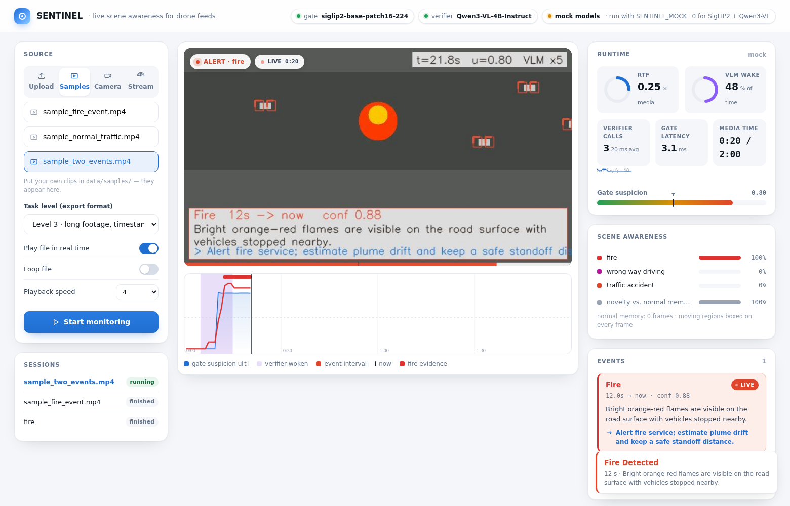

# SENTINEL — real-time drone video anomaly detection with a small VLM

**AHC / FlytBase Visual Intelligence Hackathon · 05 Sep 2026**

A cheap always-on gate watches every frame. A 4B vision-language model is woken only when something looks off.
A temporal decoder turns noisy per-second evidence into **one clean interval per real event** and stays silent
unless the evidence is clear. Every alert ships with a one-sentence explanation and a responder action.

```
video ─▶ S0 decode/sample ─▶ S1 SigLIP2 gate (100% of frames, ~5 ms) ─▶ candidate windows (~15–25%)
      ─▶ S2 Qwen3-VL-4B (+LoRA) fine-grained yes/no questions, JSON, self-consistency
      ─▶ S3 temporal decoder (class-shape priors · hysteresis · gap-merge · IoU shaping · abstention)
      ─▶ S4 events + explanation + action + honest runtime_metadata ─▶ arena JSON
```

Read **PLAN.md** for the full rationale, scoring analysis and build order.

## The application

```bash
make serve          # terminal 1: vLLM serving Qwen3-VL-4B (+LoRA)   — or point configs/default.yaml at any OpenAI-compatible URL
make app            # terminal 2: http://localhost:8080
make app-mock       # no GPU? same app with CPU mock models (SENTINEL_MOCK=1)
```

`app/` is a real monitoring application, not a viewer: pick an **uploaded video, a sample, a webcam or an RTSP/HTTP
stream**, and SENTINEL runs the cascade *while the video plays* — moving objects are boxed, the gate suspicion bar
runs under the frame, the VLM is woken on hot windows (purple bands on the timeline), and when an event is confirmed
an alert banner with the explanation and responder action is drawn onto the live frame. The right-hand panels show
RTF, wake ratio, per-class scene awareness, the live event feed and the verifier log. Every session can be exported
as an arena-format prediction, and "Mark scene as normal" seeds the site-normality memory from what has been seen.



## Five commands (batch / arena path)

```bash
make setup                 # pip install -e ".[dev]"   (add [gate] on a GPU box, [serve] for vLLM, [train] for LoRA)
make test                  # 31 tests: arena field rules, scorer, decoder, ledger, end-to-end mock pipeline
make demo                  # synthetic clips → full cascade (mock models) → HUD at http://localhost:8765
make serve                 # vLLM: Qwen/Qwen3-VL-4B-Instruct on :8000   (LORA=output/... to attach the adapter)
make run-public            # real run on the public test set, scored locally; then `make sweep`
```

Then, on the day:

```bash
make run-private LEVELS=1 OUT=submissions/L1.json      # fast: lock in L1
make check FILE=submissions/L1.json                     # upload gate: validate · no false alarms · no regression
#   → upload in the arena →
python -m sentinel.cli mark-uploaded submissions/L1.json
make run-private LEVELS=2 OUT=submissions/L2.json && make check FILE=submissions/L2.json
make run-private LEVELS=3 OUT=submissions/L3.json && make check FILE=submissions/L3.json
```

## Layout

| Path | What |
|---|---|
| `sentinel/schema.py` `validate.py` | arena contract; every "thing that catches people out" is a rejected fixture in `tests/` |
| `sentinel/ingest.py` `gate.py` | S0 decode; S1 SigLIP2 zero-shot + normality bank + motion/stationarity → suspicion `u[t]` and candidate windows |
| `sentinel/prompts.py` `verifier.py` | S2: question bank, motion-tinted frames, JSON-schema guided decoding, self-consistency, disambiguation rules |
| `sentinel/fusion.py` `decoder.py` | S3: gate+VLM fusion; hysteresis, per-class shape priors, gap merge, IoU-aware shaping, video-level abstention |
| `sentinel/emit.py` `ledger.py` | S4: events + explanations + responder actions; honest `runtime_metadata` (avg = total/count guaranteed) |
| `sentinel/scorer.py` | local replica of arena scoring (L1 pooled; L2/L3 per video; normal→0 on any prediction; IoU ≥ 0.5) |
| `sentinel/cli.py` | `run · validate · score · submit-check · mark-uploaded · merge · sweep · derive-priors · build-normal-bank` |
| `scripts/` | `make_sft_dataset.py`, `train_lora_unsloth.py`, `pseudo_label.py` (dev-time teacher), `serve.sh`, `modal_vllm.py` |
| `dashboard/index.html` | the HUD: gate curve, VLM wakes, intervals vs GT, explanation/action cards, RTF & wake-ratio tiles |
| `configs/` | thresholds, class priors, SigLIP prompt bank, VLM question bank, responder actions |

## Design in one table

| Scoring fact | What we do about it |
|---|---|
| L1 25 · L2 35 · L3 40 · Speed +5 · Reasoning +5 | Timing is 75 % of the marks → the decoder is a first-class component, not post-processing |
| Normal L2/L3 video + any prediction = 0 | Self-consistency voting + video-level abstention; gate-only evidence can never emit |
| Class right **and** IoU ≥ 0.5; fragments hurt | Gap-merge per class shape; grow short detections toward the class median but never to 2× |
| Latest upload replaces the score | `submit-check` refuses regressions / false alarms / fragments; `mark-uploaded` tracks the arena sheet |
| `explanation` bonus | Generated for 100 % of events, clamped to 20–500 chars |
| Hosted models banned at runtime | Runtime = SigLIP2 + Qwen3-VL-4B locally (vLLM or GGUF/llama.cpp). NIM/Gemini only in `pseudo_label.py` |

## Novelty (what to show on stage)

1. **Energy-budget HUD** — the gate watches 100 %, the VLM wakes on ~20 %; RTF and wake ratio live.
2. **Silence is a decision** — calibrated abstention tuned against the normal-video-zero rule.
3. **Temporal event grammar** — impulse / ramp / dwell / trajectory / static priors; a stalled vehicle *starts* when it stops.
4. **Site normality memory** — `gate.adapt_normal()` re-seeds the normal bank from the first 30 s of a new feed.
5. **Actionable alerts** — explanation + responder action + evidence timestamps on every event.
6. **Open-vocabulary watchlist** — add "open drain" to `prompt_bank.yaml` / `question_bank.yaml`; no retraining.
7. **Motion-mask attention** — Cerberus-style tint on moving regions of the VLM's key frame.
8. **Teacher → student flywheel** — big hosted VLM pseudo-labels unannotated drone footage → LoRA data.
9. **Edge path** — same code hits llama.cpp with a Q4 GGUF; SigLIP2 exports to ONNX/TensorRT.
10. **One command, tests green, honest ledger.**

## Hardware

Whole system fits one T4 (16 GB): SigLIP2-B (0.4 GB) + Qwen3-VL-4B fp16 (~9 GB) + KV cache. L4/A10G on Modal for the demo.
